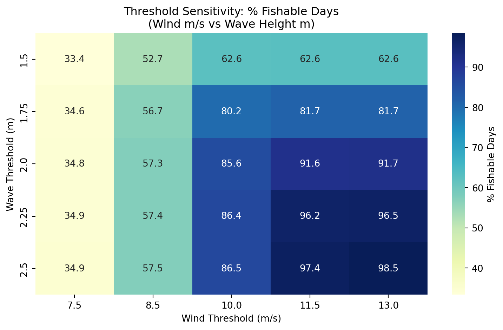

## Fisher Rainy Day Fund – A Parametric Insurance Policy {.unnumbered}

## Introduction

Fishermen are often unable to produce income due to reasons beyond their control. For example, weather and ocean conditions can make it unsafe to go fishing. Additionally, fisheries are sometimes closed deliberately to protect spawning times, ensure sustainable harvest rates, and allow overexploited stocks to replenish. While environmentally necessary, these restrictions diminish short-term fishing opportunities and income. The aim of this project is to create and cost a parametric derivative agreement that provides financial protection when fishing days are lost due to objectively defined negative environmental conditions.

The proposed Fisher Rainy Day Fund is a parametric insurance policy that is based on a Fishable Days Index (FDI). The contract counts the days in a season when fishing is legally permitted and environmentally feasible. This project uses a quantitative framework with three objectives: (1) define the fishable days using wind and wave meteorological conditions, (2) model the stochastic behavior of fishable and unfishable days through a Poisson-binomial distribution, and (3) price an index-based derivative. The system is based on weather derivative pricing but altered slightly to fit the operational realities of a small-scale island-based fisheries.

## Background

Income shocks have a big impact on small fisheries. The performance of traditional indemnity insurance in this sector is not up to the mark as it becomes difficult to verify losses and claims are settled slowly. Furthermore, controlling moral hazard is difficult. For this reason, many fishers are not insured. Parametric and index-based products provide clear and low-cost alternatives, as payouts depend on objective indices rather than observed losses [@skees2008].

## Methods

### Sources of Data

This study integrates four primary datasets to construct and validate the Fishable Days Index (FDI) for the St. Croix commercial fishery that targets Caribbean Spiny Lobster. Each dataset spans a study period from January 1, 1985, to December 28, 2024, resulting in a daily time series of 14,607 observations. All data loading, merging, and transformation were performed with the programming language “Python” to ensure full reproducibility and to avoid manual manipulation of the four source files.

The first dataset consists of daily commercial catch reports from individual fishers [@caribbea]. Each observation records information for every fishing trip made by vessels fishing in St. Croix. The important variables utilized for this analysis were the date, total number of trips, number of trips specifically for the Caribbean Spiny Lobster (CSL), and total pounds of all species caught alongside pounds of solely CSL. The dataset is a limited event log: rows are present only on days when at least three fishers filed a self-reported logbook. Days with fewer than three individual reports are suppressed to zero to protect fisher privacy, meaning that missing continuous-date rows represent a mix of truly inactive days and days with only one or two reported trips.

The second and third datasets of wind speed and wave height, respectively, are derived from the ERA5 reanalysis product produced by the European Centre for Medium-Range Weather Forecasts (ECMWF). ERA5 provides hourly estimates of atmospheric and oceanic variables at a grid resolution of 31 km from 1940 onwards, reconstructed from historical observations and numerical weather prediction models [@hersbach2020]. The wind dataset provides hourly eastward, u10, and northward, v10, wind components from 10 meters above the surface, as well as the instantaneous wind gust speed, fg10, for a single grid point representative of the St. Croix region (17.75°N, 64.75°W). The wave dataset provides hourly significant wave height, swh, at a nearby grid point (18.0°N, 64.5°W), defined as the average height of the greatest one-third of waves.

The fourth dataset consists of annual total population estimates for the United States Virgin Islands sourced from the World Bank, series POPTOTVIA647NWDB. Population data are used solely to normalize fishing activity metrics and remove secular trends in fleet capacity from the validation analysis, as described further below.

#### Daily Calendar Framework Construction 

A complete daily calendar skeleton was constructed spanning the full study period using pandas date_range functionality, producing a main data frame of explicitly 14,607 rows. The limited fishing report file was left-joined onto this skeleton so that days absent from the original file became explicit rows with zero values for all fishing activity columns rather than structural absences. This distinction is significant: a day with zero reported trips carries different analytical meaning depending on whether it reflects true fishing trip inactivity, privacy-based censoring of low-report days, or adverse weather conditions. The calendar join method makes all three types of zero-day observable within the same framework.

Hourly ERA5 wind data were processed by first computing the scalar wind speed from the u and v vector components as the Euclidean magnitude, expressed formally as $|W| = \sqrt{u_{10}^2 + v_{10}^2}$ with units of meters per second $(m/s)$. Wind speeds were additionally converted to knots using the exact conversion factor of $1 m/s = 1.9438449$   knots. Both scalar wind speed and gust speed were then transformed from hourly to daily frequency by taking the maximum of the daily values. The choice of daily maximum rather than daily mean reflects the operational reality that a single period of dangerous wind or wave conditions within a day is sufficient to prevent fishing activity regardless of conditions during other hours. This process was replicated to transform hourly significant wave heights to daily maximum values.

To isolate climate-driven variation in lobster fishing activity from background trends driven by changes in the island's population and fishing fleet capacity, all fishing activity metrics used in the threshold validation were normalized by annual population. Specifically, CSL trip rates were expressed as the number of lobster trips per 1,000 residents, and CSL catch rates were expressed as pounds of lobster caught per 1,000 residents per day. This normalization process allows for using the activity rates of fishing rather than raw counts, ensuring that this signal reflects responses to environmental conditions rather than changes driven by population demands.

The four datasets were merged into a single main daily table using calendar date as the primary join factor for climate data and integer year as the join factor for annual population values. Forward-filling was applied to any missing climate values arising from gaps in hourly ERA5 coverage, carrying the most recent available observation forward. The final main table contains 14 columns covering key information of date identifiers, fishing activity metrics, daily maximum wind speed and gust in both m/s and knots, daily maximum significant wave height, and annual population.

#### Weekday Behavioral Bias {#sec-weekday}

Prior to threshold calibration, a weekday bias analysis was conducted to determine whether fishing activity exhibited systematic day-of-week patterns unrelated to climate conditions. Mean population-adjusted lobster trip rates and the proportion of days with any reported lobster activity were computed for each day of the week across the full 40-year study period.

The analysis revealed a pronounced decline in fishing activity on Sunday relative to all other days of the week. The mean CSL trip rate for just Sundays had a value of 0.016 trips per 1,000 people compared to a range of 0.034 to 0.046 on all other weekdays, and a day-active rate of 32.1% compared to 54.4% to 62.8% on other days. This pattern is consistent with traditions of the United States Virgin Islands, where a decrease in labor on Sunday is culturally normative and not a response to environmental conditions. Sunday observations were therefore excluded from the climate threshold validation analysis to prevent behavioral suppression from contaminating the climate signal. Sunday observations were retained within the Fishable Days Index construction itself, as the index measures climate-based fishability rather than observed fishing behavior.

#### FDI Definition and Threshold Selection

The Fishable Days Index (*FDI*) is defined as a binary daily indicator equal to one (*FDI = 1* on safe days) on days when environmental conditions are consistent with safe small-vessel lobster fishing operations, otherwise FDI is equal to zero (*FDI = 0* on unsafe days). For the St. Croix CSL fishery, the index is determined by two simultaneous climate conditions: daily maximum wind speed must not exceed a specified limit, and daily maximum significant wave height must not exceed a separate specified limit. Since lobster fishing in St. Croix is open year-round with no regulatory seasonal closure, the FDI contains no regulatory component and is determined entirely by the environmental conditions. Therefore, the annual FDI for any given season is the sum of daily FDI values over a 365-day calendar year.

{#fig-1}

Initial threshold values were drawn from the small vessel operability literature. Wind speeds at or above 20 knots (approximately 10.3 m/s) are widely cited as the threshold above which small craft advisories apply in United States coastal waters, and significant wave heights above 2.0 to 2.5 meters are considered the upper operational limit for vessels typically used in St. Croix lobster fisheries. These values were used initially as starting parameters and evaluated against observed fishing activity data.

#### Threshold Validation

The selected thresholds were validated by testing whether days classified as fishable demonstrated higher population-adjusted lobster fishing activity than days classified as unfishable and validated with the fishing report data. Sunday observations were excluded from this analysis as described previously in @sec-weekday. This validation compared mean CSL trip rates per 1,000 people and the proportion of days with any reported lobster activity between the two FDI categories.

Using the final thresholds (8.5 m/s and 1.75 m), fishable days had an average CSL trip rate of 0.044 trips per 1,000 people compared to 0.039 on unfishable days, and an active-day rate of 62.5% in contrast to 56.8% on unfishable days. This difference is understood to be conservative relative to what the true climate signal likely produces. The privacy-based censoring rule applied to the fishing report data suppresses observations to zero on any day with fewer than three individual fisher reports. This censoring feature disproportionately affects days near the threshold boundary, where marginal fishing conditions may motivate only one or two fishers to go out, which are the most informative observations for threshold calibration. Therefore, the true separation between fishable and unfishable days is likely greater than these validation statistics suggest.

The sensitivity of the validation result to the threshold values was additionally assessed by identifying that wind speed is the binding constraint in the St. Croix context. Inspection of the sensitivity heatmap reveals that varying the wave threshold from 1.5 to 2.5 meters at a fixed wind threshold of 8.5 m/s changes the fishable day rate by only 4.8 percentage points (52.7% to 57.5%), while varying the wind threshold from 7.5 to 13.0 m/s at a fixed wave height of 1.75 meters produces a range from 34.6% to 81.7%.

### Methodology for Pricing the Weather Derivative

#### Contract purpose and pricing logic

The agreement shifts the risk of adverse weather conditions from the derivative buyer to the seller. The contract will not track the actual day-to-day business loss. In contrast, it observes a weather-based index. The design is based on the essential structure of weather derivatives and index insurance. Buyer pays a premium upfront [@alaton2002; @cao2004]. If the index exceeds the trigger threshold during the contract period, the seller makes the contract payment. The contract reduces loss-adjustment costs by generating objective settlements from the recorded weather data and a priori estimated losses instead of from audited firm losses [@bems2021; @worldbank2023].

The contract value in this report is based on an actuarial expected payoff. Since the underlying weather variable is not traded in deep or futures markets, the choice of a predetermined payoff fits well with weather derivatives. Earlier research applies identical expected loss analysis reasoning for temperature, rainfall, and agricultural weather-index contracts [@alaton2002; @bems2021; @richards2004]. Some other pricing models can be mentioned as well, e.g. equilibrium, indifference, or copula-based approaches. However, the actuarial approach provides a clear starting point and aligns with available data and the objective of pricing a fishability-based trigger from past weather conditions [@bressan2021; @cao2004; @xu2008].

#### Index definition and contract trigger

Let the contract cover $T$ calendar days. For each day $j$, define an indicator variable $X_j$. Set $X_j=1$ when observed weather conditions support fishing on day $j$. Set $X_j=0$ when weather conditions do not support fishing. The total number of fishable days will be counted by the contract over the entire window. Through this index, a noisy weather sequence is reduced to one contract level quantity that is easily priced by the seller and interpretable by the buyer. The cited framework is consonant with standard weather-derivative design, whereby pay-off is based on a transparent index rather than on realized revenue or profit [@bems2021; @jewson2005; @worldbank2023].

The seasonal fishable-day index is $N=\sum\limits_{j=1}^{n}X_i$. Here, $N$ counts the number of fishable days in the contract period. Let $K$ denote the strike on fishable days. The contract triggers when fishable days fall below the strike. In mathematical form, the trigger event equals $N<K$. That event defines the “limiting” or threshold-crossing event for the contract. A higher strike makes the trigger easier to hit. A lower strike makes the trigger harder to hit [@worldbank2023].

#### Historical estimation of daily fishability probabilities

For every contract day, we estimate the fishable-day probability. Let $p_j$ represent the probability that day $j$ is fishable. The $p_j$ estimates take place after the index classifies each historical day as either fishable or non-fishable. In effect, we compute one empirical probability for every calendar day in the contract window, pooling the same month-day across historical years. That measure saves seasonality. In addition, it gives January and September distinct probabilities. This step is important because weather derivatives usually require careful treatment of seasonality and calendar structure prior to pricing [@alaton2002; @jewson2005].

Instead of imposing a single probability common to every day, we allow every day to have its own estimated probability $p_j$. This flexibility inspires the Poisson-binomial model. All daily probabilities would have to be matched by the ordinary binomial model. The Poisson-binomial model can handle independent daily Bernoulli trials with unequal success probabilities, which fits a seasonal weather calendar much better [@biscarri2018; @chen1997; @hong2013].

### Poisson-Binomial Model

#### Why this model fits the problem

The Poisson-binomial distribution signifies the total of independent Bernoulli variables that need not share the same success probability. It harmonizes with the contractual weather-based index in a natural fashion as there are predefined conditions that define total fishable days. Every day has its own historical fishability probability $p_j$. After considering the daily indicators, the model considered daily probabilities as independent and treats them as Bernoulli variables (Fishable or Non-fishable). The seasonal count $N$ was made to follow a Poisson-binomial distribution. Research in statistics on this distribution has established the theory, computation and use of a distribution with a trial probability that varies [@chen1997; @hong2013]. Formally, $X_j\sim\text{Bernoulli}(p_j), \quad j=1,2,\dots, T$ and assume independence across days, $N=\sum\limits_{j=1}^{T} X_j \sim \text{Poisson-Binomial}(p_1,  p_2, \dots, p_T)$. The expected number of fishable days follows, $E[N]=\sum\limits_{j=1}^{T}p_j$. The variance follows, $Var(N)=\sum\limits_{j=1}^T(1-p_j)$.These moments summarize the center and spread of the seasonal fishable-day distribution under the independence assumption.

#### Probability of mass function

The exact probability that the season ends with exactly 𝑛 fishable days equals $$P(N=n)=\sum\limits_{A\epsilon F_n} \prod\limits_{j\epsilon Ap_j}(1-p_j), \quad n=1,2,\dots, T$$

Where $F_n$ denotes the collection of all subsets of $\{1, \dots, T\}$ that contain exactly $n$ elements. This equation sums up the probability of every possible path that produces exactly $n$ fishable days. The equation gives the full probability mass function of the contract index. It also provides the foundation for trigger probability and price calculations [@chen1997; @fernandez2010; @hong2013].

This report does not enumerate all subsets directly because that route grows expensive when $T$ becomes large. Instead, the code uses recursive convolution, which updates the distribution one day at a time. Let $f_m(n)$ denote the probability of obtaining $n$ fishable days after the first $m$ contract days. Start with $f_0(0)=1, f_0(n) = 0, \text{ for } n>0$.

Then update with $f_m(n)=(1-p_m)f_{m-1}(n) + p_mf_{m-1}(n-1), \text{ for } m=1,2,\dots, T$ for all valid $n$. After the last update, $f_T(n)=P(N=n)$. Statistical studies show that recursive and Fourier-based methods provide exact or highly efficient ways to compute the Poisson-binomial distribution in applied work [@biscarri2018; @chen1997; @fernandez2010; @hong2013].

### Limiting Probability Equation

#### Trigger probability under the strike limit

The key risk quantity in this contract comes from the probability that fishable days will fall below the strike. That probability drives the contract price directly since the payoff uses a fixed indemnity. Let $\Psi(K)$ denote the limiting probability of the contract trigger.

Then $\Psi(K)=P(N<K)=\sum\limits_{n=0}^{K-1}P(N=n)$. This equation gives the cumulative lower-tail probability of the Poisson-binomial distribution up to one day below the number of days associated with the strike percentage times the mean fishable days. It answers the central pricing question: how often would the season fail to reach the minimum acceptable number of fishable days? [@biscarri2018; @fernandez2010,@hong2013]. If the strike comes from a percentage of expected fishable days, the model can define $K_s=round(s\mu), \mu=E[N]=\sum\limits_{j=1}^Tp_j$

where the value of strike percentage is explored from 0.80 to 0.99 The strike percentage makes the conversion into an integer number of fishable days. The model then calculates $\Psi(K)$ for each level of strike. This threshold design is consistent with common weather index practice where the contract maps an index threshold into a trigger probability and then to an expected payout.

#### Payoff Design

#### General payoff function

A weather derivative price starts with the payoff function. Let $G(N)$ denote the contract payoff at expiration as a function of the seasonal fishable-day count $N$. The most general actuarial pricing equation then discounts the expected payoff back to the pricing date: $$V_0=e^{-r\tau}E[G(N)]=e^{-r\tau}\sum\limits_{n=0}^TG(n)P(N=n)$$

Where $r$ denotes the continuously compounded risk-free rate and $\tau$ denotes the contract length in years. This expected-payoff structure sits at the center of actuarial and burn-analysis pricing for weather-index products [@alaton2002; @jewson2005; @taib2012; @worldbank2023].

#### Fixed-payout contract used in the code

We use a predetermined and fixed payout. The payout would be issued if the total number of days in the contract period falls below the strike. Let $L$ denote that payout. Then the payoff function equals $G(N)=L1(N<K)$ where $1(N<K)$ equals 1 when the trigger hits, and 0 otherwise.

Under this design, the weather derivative price simplifies to $V_0=e^{-r\tau}LP(N<K)=e^{-r\tau}L\Psi K$. This form makes the pricing logic very clear. The discount factor handles time value. The limiting probability handles event likelihood. The payout level handles contract severity. Multiply the three terms, and the model returns the fair actuarial price [@jewson2005; @taib2012; @worldbank2023].

In implementation, the code sets the fixed payout from the shortfall between the expected fishable-day count and the strike, multiplied by average profit per day as $L=(\mu-K)\pi^-, \text{ for }K\le\mu$. Where $\pi^-$ denotes average profit per fishable day. If the analyst wants a payout rate $\alpha$, then the formula becomes $L=\alpha(\mu-K)\pi^-$. This rule creates a simple and transparent contract. It does not reward larger realized shortfalls once the trigger fires. It only pays one fixed amount per strike. That feature keeps pricing simple, but it also sacrifices some loss sensitivity [@kath2018; @worldbank2011; @worldbank2023].

#### Step-by-Step Pricing Procedure

#### Build the daily index

The meteorological department begins recording daily weather observations. The analyst selects weather thresholds that define what is deemed a fishable day. The wind speed and wave height provide thresholds for our study. Our code assigns each historical day to a fishable or non-fishable label. This step generates the binary series necessary for Bernoulli modeling. The weather-derivative practice usually begins at this stage of index construction, since the derivative settles on the index, not the raw weather variables [@bems2021; @jewson2005; @worldbank2023].

#### Estimate Day-specific probabilities

Next, the analyst estimates $p_j$ for each calendar day in the contract. The code eliminates February 29 so that the calendar will have 365 days only. This then pools the month-day across all years and calculates that date’s historical fishable frequency. After this step there will be one probability for each contract day. The method allows different seasons to take values independently without forcing all days to value from the same distribution. The Poisson-binomial choice is justified by that feature [@chen1997; @hong2013; @jewson2005].

#### Compute the seasonal distribution

Once $p_j$ values have been estimated for the model, the full Poisson-binomial probability mass function for $N$ is computed. Each recursive update starts on day 1 and folds one day into the distribution repeatedly. The model has a probability for each possible total fishable-day count from 0 to $T$. A full distribution conveys more information than just the means. It enables the analyst to calculate trigger probabilities in the lower tail, expected payoffs, and premium sensitivity across various strike levels [@biscarri2018; @fernandez2010; @hong2013].

#### Interpretation of the Price

This price represents the current worth of the expected contract payoff calculated using the historical probability model. The price omits transaction costs, profit loading, administrative charges, or a market price of weather risk. Research on weather derivatives indicates that incomplete-market settings can justify alternative pricing rules, including the use of equilibrium or indifference methods when traders demand compensation for non-hedgeable weather risk. However, our Poisson-binomial price based on actuarial technique is suitably transparent and represents a fair-value benchmark [@alaton2002; @cao2004; @richards2004; @xu2008].

As the strike percentage increases, the contract is triggered more easily because the season must meet a higher target for fishable days. Hence, the lower tail cumulative probability increases. Beneath a fixed payout design, the premium increases since the contract pays the same amount more often. With a shortfall design, the premium usually rises even faster as the contract pays out more often and can pay larger amounts. The upward pattern is what standard derivative and insurance intuition suggests: more coverage costs more [@kath2018; @worldbank2023].

#### Results and Findings

#### Threshold sensitivity and final index choice

The threshold sensitivity analysis demonstrates (Table 1) that the fishable-day index is quite responsive to the chosen wind and wave cutoffs. Reduced thresholds yield a significantly more limiting index, where most days are classified as non-fishable. A higher threshold was identified as more permissive (classifying most and almost all days as fishable). That methodology section states that the daily fishability indicator is determined by whether both the wind speed and the wave height do not exceed the cutoffs chosen. The sensitivity table indicates that for the strictest threshold pair, the percent of fishable days is around 33.35% (7.5 $m/s$, 1.5 $m$). However, for the loosest threshold pair, the percent of fishable days is around 98.47% (13.0 $m/s$, 2.5 $m$). The average yearly fishable day index moves in the same manner. It increases from roughly 121.80 days to 359.60 days. The yearly deviation does not monotonically shift throughout all threshold pairs, but it does drop when the threshold becomes very loose and ends up with the index approaching the ceiling of the annual calendar, leaving less room for interannual fluctuation.

The pair of 8.50 $m/s$ for wind and 1.75 m for wave height selected provides a balanced index (Table 1). This configuration results in 56.67% fishable days, a mean annual fishable day count of 206.95, and an annual standard deviation of 23.95 over the total historical record. This selection bypasses the two weak extremes. If the threshold is very strict, it will classify too many days as non-fishable and compress the commercial meaning of the index. A highly lenient threshold would deem nearly every day suitable for fishing, weakening the derivative trigger itself. The chosen threshold thus conserves enough non-fishable days to generate variation in risk, and nevertheless, incurs plausible operating conditions. The chosen approach has a methodological objective of developing a weather-based index that accounts for actual fishing access rather than merely the meteorological variation directly.

#### Contract window summary and annual fishable-day distribution

The contract is for the full calendar year, January 1 to December 31. This design gives a 365-day window of exposure that covers the entire seasonal cycle in marine weather. The probability summary reveals that the range over the contract period is likely 206.80 fishable days. According to the annual contract FDI summary (Table 2), the mean is 206.78 days with a standard deviation of 23.94 days. The two values are nearly equal. This close agreement suggests that the daily empirical probabilities correspond well to the historical annual counts. Essentially, the methodology’s historical daily-probability construction produces the long-run average fishable day within a year with little error.

The 207 fishable days mean the selected threshold, supports fishing on roughly 57% of the days in a normal year (Table 2). An inter-annual variability of around 24 days is suggested by the standard deviation. This amount is relevant for pricing. A derivative contract must ensure sufficient dispersion in the index to create a meaningful lower- tail trigger probability. Here, the yearly difference facilitates the need. Simultaneously, the spread does not appear to be so large as to indicate an unstable index or poorly defined index. Consequently, this measure assesses fishable days and can be used as an underlying contract variable.

#### Seasonal pattern in daily fishability probability

The daily probability plot shows a clear seasonal pattern within the year. It follows from the methodology section that the model estimates probability 𝑃𝑗 separately for each contract day, pooling the same month-day over years. The curve in the plot does not remain flat. It demonstrates a strong seasonal structure instead. In the early season, the probabilities of being able to fish daily are around 0.35 to 0.50. Those probabilities rise during late winter and spring, sharply dip around mid-contract year, and then rise again towards a second high-probability period later in the year (Figure 2).

This trend comes with two important repercussions. In the first place, the contract index does not follow a stationary Bernoulli process with a daily constant probability. The Poisson-binomial framework implemented in the methodology is justified by that result which allows unequal probability. Seasonal structure shows that risk is not spread evenly over the year, but has months dedicated to risk. A concentrated risk window with additional non-fishable days is marked by a mid-year dip. This period at the end of the year is under a high probability window. The seasonal variation influences the annual fishable days distribution of annual fishable days and the lower-tail trigger probability. The findings thus confirm that we were right to not homogenize all days into one average probability and preserve calendar-day heterogeneity.

According to the plot, it is observed that during the least favorable periods, many daily probabilities are well below 0.5, while during the most favorable periods, probabilities rise above 0.8. This range shows a strong seasonal contrast. The contrasting elements enhance the substance of the index. Furthermore, it upholds the pricing logic as seasonal structure contracts can capture real operational exposure better than those based on constant average hazard contracts.

#### Strike design and trigger behavior

The pricing analysis assesses strike levels between 80% and 95% of the expected average number of fishable days calculated over a one-year contract period. This design directly ties the available data to user-specified percentage of expected contract fishable days. The subsequent periods between strikes vary from 165 to 196 days (Table 3). With increasing strike percentage, the trigger threshold moves towards 207 days, which is the expected annual fishing days. This change raises the chances of payout due to increased low-event odds, but results in a lower payout since fewer days are factored into the losses.

The probabilities of triggers indicate a strong non-linearity response. The contract gets triggered rarely at lower levels. The prospect of a trigger only has a probability of 0.000002 at 80% strike. Further, it is 0.000004 at 81% and 0.000019 at 82%. These values suggest a nearly dormant contract. Even a very adverse weather year would have to fall well below the long-run mean before the payout condition trigger. As a result, the contract guarantees minimal practical protection in this strike range.

Once the strike crosses above the upper-80% level, the sensitivity of the trigger probability begins to move. It goes up to 0.001289 at 87%, 0.002605 at 88%, and 0.005032 at 89% (Table 3). The likelihood then quickly rises in the region of 90% to 95%. At 90%, it reaches 0.009303; at 91%, 0.016460; at 92%, 0.027895; at 93% it reaches 0.045302; at 94%, 0.070555; finally, at 95%, it reaches 0.105465. This pattern is non linear. The upper strike range penetrates further into the core of the annual fishable-day distribution. A slight adjustment in the strike rate, thus, has a larger impact on trigger frequency.

It holds practical significance. A designer who accepts strikes under 88% would probably be selling a product that has no economic relevance as the trigger probably never fires. An option that settles at the money or strikes near 93% to 95% will create a much more active hedging tool. Even at that range, an event-based contract would remain in place, no annual transfer. Consequently, the findings suggest that the upper strike range is the most defensible area for meaningful hedging.

#### Derivative price profile across strike levels

The continuously rising weather derivative price with respect to strike percentage faces a steep change with respect to strike. The fixed-payout pricing formula, 𝑉0=𝑒−𝑟𝑡𝐿Ψ(𝐾), directly leads to this pattern. As the strike rises, the gap between the expected fishable days and the strike narrows, causing the fixed payout to decline in the current implementation. However, the payout falls faster than the trigger probability rises. This probability effect dominates the price function.

The price is practically nonexistent for low strikes. At 80% the amount is \$0.02, at 81% the amount is \$0.06, at 82% it is \$0.23 and at 83% it is \$0.54 (Table 3). Even at 86%, it costs under \$5.58. The values indicate that lower strike regions generate a very low expected protection value. The contract rarely activates to warrant a significant premium, according to the experts.

The price then increases quickly once the strike enters the low-90% range (Figure 3). It climbs to \$20.52 at 88%, \$36.45 at 89%, \$61.46 at 90%, \$98.28 at 91%, \$148.81 at 92%, \$212.86 at 93%, \$286.64 at 94%, \$361.38 at 95%. As a result, the price curve is convex. The derivative becomes markedly more costly as the strike nears the expected annual total fishable days.

This shape is economically viable. A higher strike position triggers nearer to the midpoint of the annual fishable-day distribution. While the fixed payout amount falls, the payout frequency increases with that move. It can be observed from the results that the rise in trigger probability surpasses the decrease in a benefit size (Figure 3). That collaboration leads to a sudden rise in the premium curve. As per the model, it is not the fixed payout size but rather triggers probability that drives price over the tested range.

#### Joint interpretation of trigger probability and premium

The trigger probability curve and the premium curve both show positive exponential patterns but with different rates. The difference is due to the pricing formula. The premiums reflect the low tail probability and the fixed payout level. In the design under test, the payout decreases as the strike percentage increases. However, the effect of lower tail probability has a stronger influence. The interaction generates a curve for the price per number of fishable days that initially rises smoothly and then increases at a faster rate (Figure 3 & Figure 4).

## Discussion

This project did not explicitly consider related logistics and financial overheads of pricing a weather-based derivative to cover non-fishable days. Here, we discuss some of the logistics the proposed rainy day fisher fund would need to further consider including reinsurance, markups, and pooling risk. To offer the parametric weather-based insurance, the insurer would need to have sufficient funds and ensure that payouts would be rapid upon reaching strike conditions. Unless a fishing community were to develop a reciprocal insurance exchange, through a self-insurance pool with sufficient funds to cover potential payouts, the cost of issuing any parametric insurance policy would also need to include operating expenses and reinsurance. Since this analysis consisted only of a single industry located in a small geographic area, the proposed program could benefit from developing similar frameworks across a wider geographical region or including other types of industries to diversify risk. Such diversification would reduce the expenses of external reinsurance.

The process of pricing a parametric insurance policy serves as a simplified case study and exploration of the fundamental dynamics of pricing parametric insurance. First, we focused on developing a fishable day index as an objective metric evaluated from specific timeseries of meteorological data. Then we utilized pricing. Although we intentionally structured this analysis to be simple to interpret and evaluate, we acknowledge that refining the methods could lead to more accurate strike probabilities. High-quality fisher data and rationales for staying in port would be the primary tool for reducing basis risk. Direct conversations or surveys with fishers could improve the estimated accuracy of losses and help identify additional threshold conditions that allow effort adaptations versus conditions that impede all potential fishing activity.

The result of the sensitivity test showed that the index varied strongly with thresholds of winds and waves. The thresholds are too strict thus labeling too many days non-fishable, making the index less practical. Contract triggers become weaker when very loose thresholds classify all days as fishable. The 8.5 m/s wind speed and 1.75m wave height value were selected to avoid extremes. It creates about 206.95 fishable days each year and has enough annual variation for pricing. Recent studies connecting weather thresholds and sea-state limits to marine access and operational downtime are consistent with this outcome. As per research, what is selected as threshold must depict actual working conditions, and not just the meteorological variation [@chittethramachandran2022; @costas2023; @karathanasi2022]. This threshold strikes a nice balance, as demonstrated in our study. It still preserves commercial meaning and reflects real fishing conditions.

The pricing results also strengthen the structure of contracts. The regular fishability likelihoods follow a clear seasonal pattern, so the risk does not remain constant throughout the year. The observed pattern is a strong endorsement for the implementation of the Poisson-binomial model which makes the probabilities daily contract period-varying. The analysis of strikes shows practically no protection from low strikes, i.e. strikes from 80% to 87%, which is hardly that the trigger will activate. On the other hand, 93% to 95% strikes lead to the tanks producing a more active hedge with increased trigger probabilities and higher premiums. The evidence presented here is consistent with other studies on parametric insurance which find significant dependence of contract performance on trigger design and threshold placement which is typically at the core of the loss distribution [@larsson2023; @xu2008]. The data indicates that the upper strike range offers protection that is the most useful for fishers that want coverage during moderately adverse years, as opposed to only extreme years.

Currently, we still have limited information that we can use to independently determine fishable days. Although we did not consider that day-to-day business data would be required, information related to costs, revenue, and rationale for non-fished days would be critical to improve weather derivative pricing. Ideally, the benefits associated with rapid payments under a straightforward parametric insurance framework could serve as motivation for improving the quantity and quality of self-reported fisher activity. By establishing a transparent parametric framework, we were able to develop a user interface dashboard to communicate the weather derivative pricing over a range of strike percentages and different wind and wave threshold scenarios. By maintaining and improving this interactive dashboard, fishers would be able to customize the conditions to meet personal needs and preferences related to risk tolerance and budget. Ideally, creating a positive feedback loop of improved reporting, leading to more accurate thresholds, thereby reducing basis risk and making the insurance more affordable.

## Conclusion

This study proposes the fishable-day index for developing parametric insurance contracts for fishers. The procedure creates a daily index based on wind speed and wave height. It then estimates day-specific probabilities and applies to a Poisson-binomial model for seasonality. The findings indicate that selection of thresholds strongly governs index behavior. Highly restrictive parameters significantly decrease fishing days. Loosening limitations removes risk. The chosen thresholds of 8.5 m/s for wind and 1.75 m for wave height create a balanced set of criteria. It generates approximately 207 fishable days annually and sustains enough variance for pricing. The validation confirms that fishable days correspond with a peak fishing activity, thus justifying the practical relevance of the index. The seasonal probability pattern bolsters the choice of model since it shows real changes in fishing conditions during the year, allowing us to avoid an assumption of constant risk. The pricing results have important economic consequences. Strike levels that are too low mean almost zero trigger probability, which also does not offer much protection. Increasing the strike levels increases the chances of triggering and the premium. The range from 93% to 95% offers the most suitable balance of cost and coverage. The contract can respond to conditions that are only moderate or worse rather than only extreme events. The convex price pattern indicates that pricing is driven more by trigger probability than by payout size. The paper also identifies major limitations. Operational costs, reinsurance, and market risk loading are not included. It is also dependent on limited data of fishing activity that may mask true behavior because of reporting limitations. In the future, we must improve the quality of data, including fisher feedback, and further refine the threshold conditions. Broadening the framework to other regions or sectors would allow risk pooling. The research provides a well-defined and pragmatic framework for constructing a weather-based insurance instrument beneficial to fishers under uncertain conditions of the sea.

## References

::: {#refs}
:::
